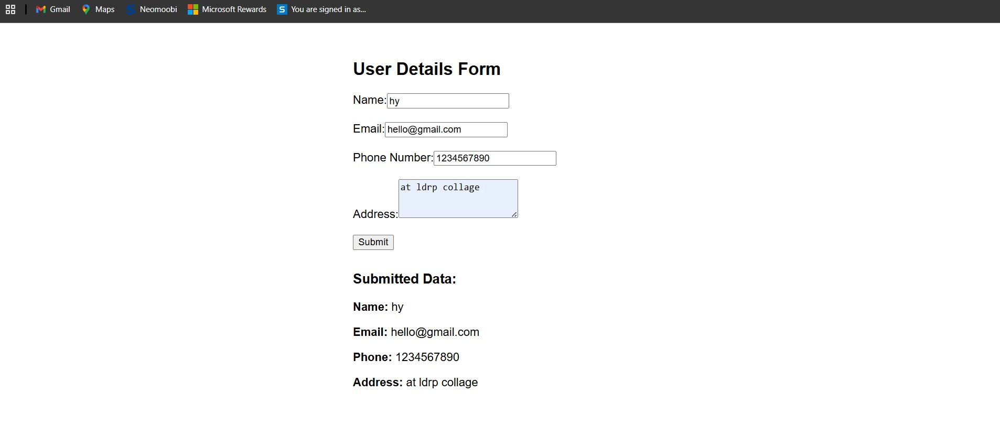

Day 2 : Introduction to Angular
• Explore Angular overview, build a basic application, and integrate basic Angular functionalities.
• Hands-on: Create a simple Angular application with forms and components.

### CROME RUNNING PREVIEW 

