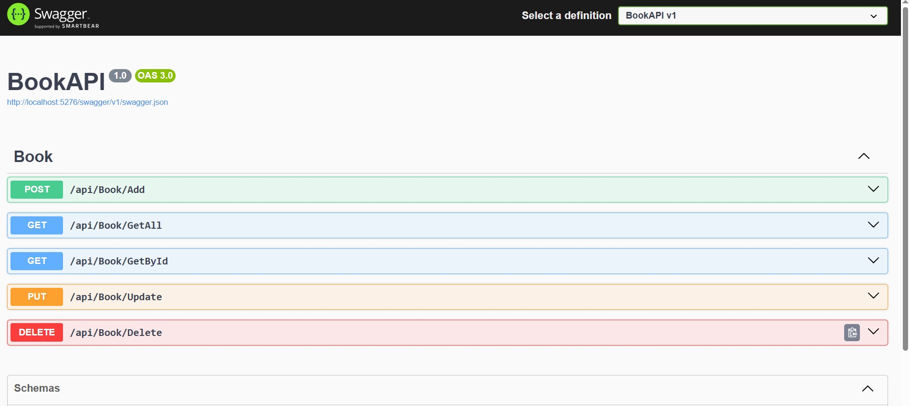

Day 3 : Introduction to .NET
• Introduction to .NET and web API. Understand Swagger.
• Understand N-tier Repository pattern folder structure and Entity Framework (EF).
• Hands-on: Familiarize with .NET project structure and EF.

### CROME RUNNING PREVIEW 

