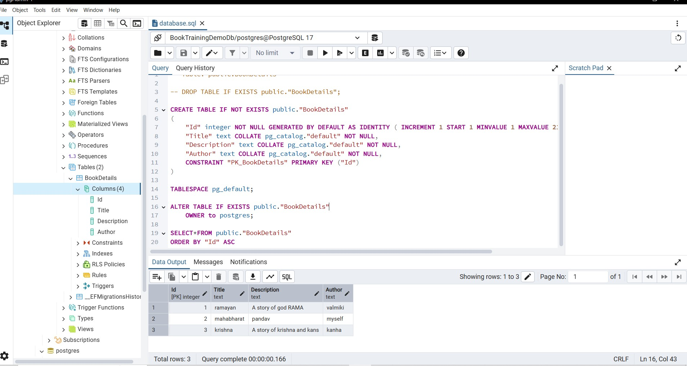

   
Day 4 : .NET with Code First approach, LINQ, and Login Page 
    • Understanding of LINQ. 
    • Understanding of Code First Approach. 
    • Hands-on: Build a login API and understand how to write LINQ queries with Code First Approach.

 ### CROME RUNNING PREVIEW 

